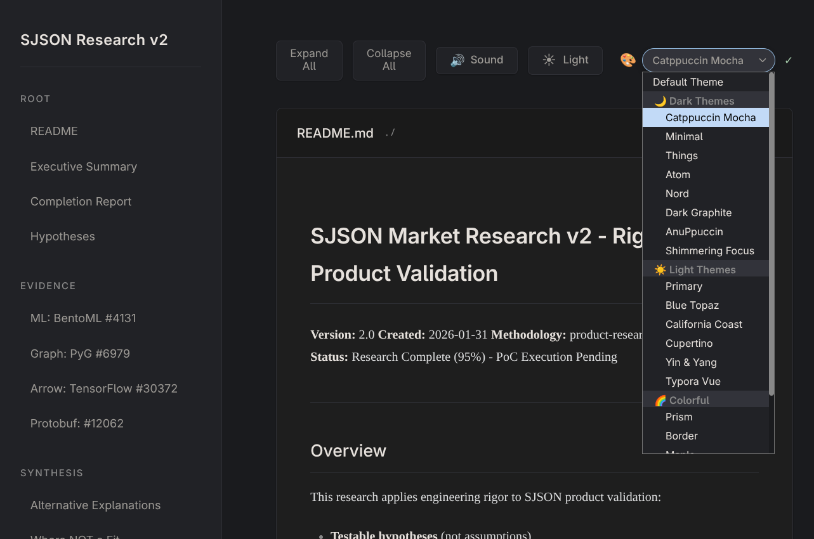
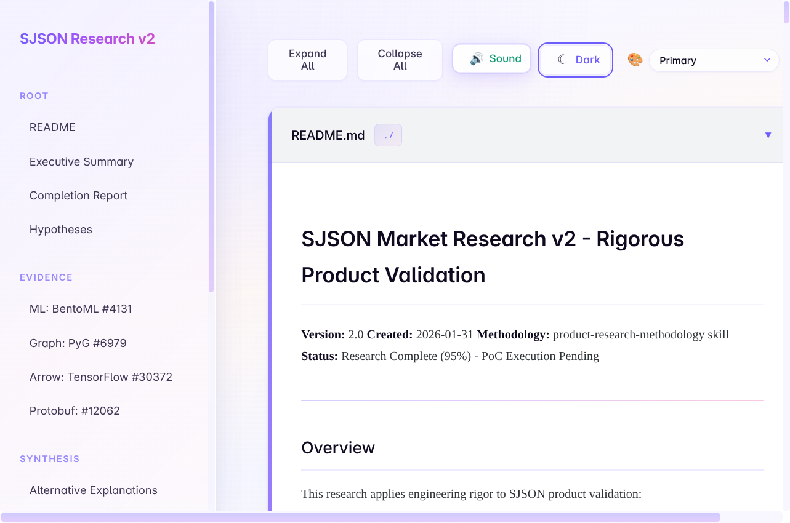

# VelvetMD 🖤

*Markdown that feels like silk.*

A dead-simple markdown reader that makes your docs look like they belong in a design magazine. Drop in your `.md` files, pick a theme, and watch your words transform.


<p align="center">
  
  
</p>

## Why VelvetMD?

Because your documentation deserves better than GitHub's default renderer. Because you've spent hours tweaking your Obsidian vault's aesthetics and want that same vibe everywhere. Because reading should feel *good*.

## Features

- 📖 **One file, zero dependencies** — Just `index.html`. That's it.
- 🎨 **20+ Obsidian themes** — Things, Catppuccin, Nord, Minimal, Dracula, and more
- 🌓 **Dark/light aware** — Respects your system preference
- 📱 **Responsive** — Looks good on your phone, tablet, or ultrawide
- ⚡ **Instant** — No build step, no npm install, no waiting

## Quick Start

```bash
git clone https://github.com/DomainxTend/VelvetMD.git
cd VelvetMD
open index.html  # or just double-click it
```

That's it. You're reading in style.

## Themes

We raided the Obsidian community's finest:

| Vibe | Themes |
|------|--------|
| **Minimal** | Things, Minimal, Border |
| **Cozy** | Catppuccin, Nord, Maple |
| **Bold** | Primary, Prism, 80s Neon |
| **Classic** | Solarized, Atom, Typora Vue |

Switch themes with the dropdown. No restart needed.

## Use Cases

- Documentation sites without the complexity
- Personal wikis that don't look like 2005
- Markdown previews that spark joy
- Offline reading that doesn't hurt your eyes

## Philosophy

Good tools disappear. VelvetMD gets out of the way so you can focus on what matters: the words.

---

*Made for readers who care about the details.* ✨
